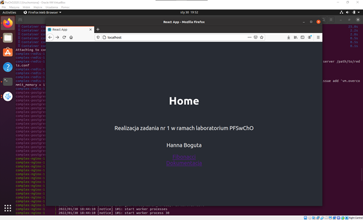

## Aplikacja bazuje na przylkadzie z laboratorium 9.
## Dokonano zmian:
- dodano plik docker-compose.dev.yml
### client:
- dodano potrzebne strony (Main, Documentation)
- dodano zdjecie architektury
- zaimplementowano router w pliku App.js
### server:
- w pliku index.js dodano ograniczenie wspolczynnika ciagu k do 20
### worker:
- zmieniono implementacje funkcji obliczajacej ciag fibonacciego w pliku index.js
## Uruchomienie uslugi
W glownym katalogu projektu nalezy uzyc polecenia: COMPOSE_DOCKER_CLI_BUILD=1 DOCKER_BUILDKIT=1 docker compose -f docker-compose.dev.yml up --build
Aplikacja zostanie uruchomiona na porcie 80
## Strona glowna aplikacji
